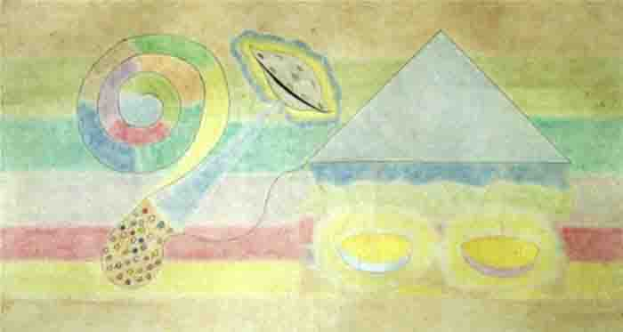

# MENSAJE TELEPÁTICO DEL PADRE ETERNO AL MUNDO TERRESTRE; MENSAJE SEGUNDO; EL PRIMER MENSAJE FUÉ OCULTADO AL MUNDO POR LA ROCA RELIGIOSA.-

Sí hijos; se nace buscando la verdad; se inicia para el mundo del conocimiento, la revelación esperada por siglos y siglos; vuestro Creador se vale de doctrinas vivientes para hacer avanzar a los mundos; en el pasado os envió la ley Mosáica; le sucedió la doctrina Cristiana; la tercera la que se inicia, es la doctrina del Cordero de dios; Esta doctrina será llamada también Ciencia Celeste; su principio está en los elementos mismos de la naturaleza; la escritura telepática es el medio de comunicación que se vale el Creador del universo; siempre a sido así; en el pasado las doctrinas de los profetas, se recibían por telepatía; porque todas las cosas tienen un principio y una causa de ser; la doctrina del Cordero de dios, no tiene término; porque el universo no lo tiene; y por lo mismo, se extenderá por toda la Tierra; será traducida a todos los idiomas del mundo; su influencia será tal, que hará caer al materialismo explotador; porque nueva moral viene al mundo; la moral propia del Milenio de Paz; las doctrinas del Padre eterno, siempre transforman a los mundos; tal como sucedió en el pasado de la Tierra; la nueva Revelación fué pedida por los actuales espíritus humanos; y se os concedió; todo instante vivido en vuestras exsistencias, lo pedísteis y se os concedió; la nueva revelación es la continuación de las sagradas escrituras; una cosa es ser estudioso de las escrituras, y otra ser religioso; lo primero es eterno porque vuestro espíritu busca siempre su propio orígen; lo segundo es comercio de la fé; las religiones son las primeras en ser acusadas ante el mundo; en la doctrina del cordero de dios; las llamadas religiones en su moral humana han dividido al mundo de la fé; no tienen derecho a hacer tal cosa; han olvidado que sólo exsiste un sólo dios nomás; una sola verdad; sólo satanás se divide así mismo; los espíritus religiosos son los mismos fariseos de la época romana; pidieron al Creador nacer de nuevo y enmendar errores del pasado; y se les concedió la prueba; no olviden los religiosos del mundo, que todo espíritu es probado en el destino que eligió; vosotros espíritus de la roca, hicísteis lo mismo en lejanos mundos; dividísteis otros rebaños; dejásteis la confusión espíritual en otras criaturas; llenásteis de templos materiales muchos planetas; y volvísteis a hacerlo en la Tierra; es por eso que seréis juzjados los primeros; vosotros al violar la ley, os convertís en los mismos anti-cristo; y todo violador de los Mandamientos, de hecho lo es; vosotros decís la santa madre iglesia; yo os digo que nadie en este mundo es santa ó santo; la verdadera humildad no necesita de títulos que son desconocidos en el Reino de los Cielos; hasta vuestro microscópico planeta lo es; sólo el Padre y ciertos profetas conocen el planeta-polvo llamado Tierra; la causa de ello es que el universo viviente del Padre Jehova no tiene fín; y quien se cree grande, no lo es; por vosotros se escribió la palabra ramera; porque comercíais con mi divina ley; ciegos guías de ciegos; que transmitís a otros ciegos, vuestros errores; al extenderse la nueva doctrina, se dividirá vuestra roca de egoísmo espíritual; la palabra roca no simboliza eternidad de nada; la Tierra es relativa y no eterna; vosotros creéis que vuestra iglesia es eterna; los acontecimientos que vendrán, os sacarán de este error; sólo los humildes de corazón, tienen ganada la eternidad; no, los que enseñan la moral dentro de la inmoralidad; cuando mi Hijo Primogénito dijo en el pasado de la Tierra: Sobre esta roca construiré mi iglesia, lo dijo viendo el futuro de la humanidad; porque la Trinidad Solar está en todas partes; está también en los tiempos vivientes: pasado, presente y futuro; ¿y qué es lo que vió? vió todas vuestras violaciones; vió como perseguíais a inocentes criaturas; porque no compartían vuestras ideas; vió como las mandábais a las hogueras; vió como perseguíais a grandes estudiosos y escritores; por el sólo hecho de haceros ver el error; vió como coronábais reyes terrestres; sabiendo vuestra roca egoísta, que sólo exsiste un rey de reyes; el divino Padre; el que dá y quita la vida; el título de rey es del mundo celeste; al demonio se le llama espíritu-rey; los Mandamientos no enseñan hacerse rey; ellos mandan ser humildes por sobre todas las cosas; vió como bendecíais las armas conque se matan los hijos del Padre; sabiendo vosotros demonios, que el divino Mandamiento dice: No matarás; vió el comercio de la fé; y vió toda inmoralidad en vuestros espíritus; más os valdría no haber pedido nacer de nuevo antes de caer de nuevo en violación; vuestras religiones son desconocidas en el Reino de los Cielos; y es desconocida toda moral que pretenda dividir la fé de los hijos del Padre; el único templo conocido en el Reino, es el templo del trabajo; el trabajo es el mandato más antiguo que exsiste; antes que naciera vuestro microscópico planeta, el trabajo era y es practicado en colosales mundos; el templo del trabajo jamás se reduce a polvo; vuestros templos materiales, sí que se vuelven polvo; y con ello desaparece en este planeta, la adoración material; una adoración que nunca debió enseñarse; por esta adoración que descansa en la hipocrecía, tenéis atrasado en veinte siglos al mundo; en su plano moral y espíritual.-

Sí hijito; este dibujo celeste significa que toda justicia sale del mismo modo como se reproducen los seres; todos los espíritus humanos vieron esta justicia en el Reino de los Cielos; porque a todos les fué dado ver su propia justicia; todo exsiste en el Reino de los Cielos; nadie viene ciego al mundo en cuanto a lo espíritual; la justicia se amolda a vuestros actos; porque cada uno prometió hacerse su propio cielo; la justicia tiene su ley en los Mandamientos vivientes; que son la misma vara conque seréis medidos; cada una de vuestras ideas posee una intención; y toda intención se vuelve física y viviente en el Reino; la intención es jusjada cuando el espíritu a cometido violación con ella; el cuerpo humano es producto de leyes magnéticas; salidas del macrocosmo; y llamadas leyes divinas; quien niege ser divino en lo microscópico que representa, niega al Padre; que quiere lo mejor para sus hijos; y quien niega al Padre, niega su propia eternidad; porque en infinitos cielos le leen la mente; y cuando esas criaturas celestiales, leen en los espíritus, lo hacen juzjando; quien niege al Padre, los cielos vivientes también le niegan la entrada; lo que se hace abajo, repercute arriba; y a donde vaya vuestro espíritu, la ley es la misma; mis mandatos son iguales tanto arriba como abajo; lo que cambia es la filosofía que por un instante se vive; vuestra justicia es y será espíritual; lo material no queda en vuestra sal de vida; en vuestro conocimiento; la realidad única para todo espíritu, es la eternidad que vive; no es lo efímero; que sintió cuando poseía cuerpo físico; cuerpo de carne que solicitó; y le fué concedido; conceder un cuerpo físico, no es como conceder una cosa cualquiera; el cuerpo es viviente que momentáneamente pidió también tal geometría física; y le fué concedido; la herencia es igual para todos; materia y espíritu tienen derechos iguales; ambas piden; se fusionan leyes espírituales y leyes materiales; conocida en el Reino de los Cielos, como arca de las alianzas; porque la materialización de un espíritu, no se hace a la suerte; se hace con responsabilidad; decir lo contrario, es menospreciarse así mismo; y quién se menosprecie, al Padre menosprecia; que se encuentra en él; ¿no se os enseñó que vuestro Creador está en todas partes? ¿en lo imaginado y lo inimaginado? ciertamente que lo sabéis de boca; más, no por conocimiento propio; por esfuerzo propio; por sudor de frente; por mérito propio; el que busca encuentra; porque es premiado en el grado que empleó en la más grandiosa búsqueda; porque podéis buscar muchas cosas en vuestras exsistencias; y si no buscáis al Padre que os dió la vida, no entraréis al Reino de los Cielos; nunca han entrado los ingratos; sólo los humildes; los que soportaron sus propias pruebas en la vida; porque fueron pruebas pedidas por ellos mismos, en el Reino; toda prueba que se pasa en la vida a cada instante, a cada segundo, se pidió; y se os concedió; hasta la forma y característica de vuestras muertes, lo pedísteis; y dentro de vuestras pruebas, pedísteis cumplir la más elevada moral; la única; porque sin ella no entraréis jamás al Reino de los Cielos; y pedísteis que tal moral, os fuera enseñada en la Tierra; y se os concedió los divinos Mandamientos; ellos son la vara; porque por ellos seréis juzjados; y así será hasta la consumación de este planeta; bién podrían los espíritus humanos, no estudiarme nunca; más, el no vivir en la moral de mis Mandamientos, eso es tiniebla; porque nunca entraríais donde está el Padre; es tan inaudito el tiempo que estaríais lejos de la luz, que tendríais que nacer de nuevo para leer la cifra; lo que no está en vuestra microscópica evolución; la justicia que pedísteis, comienza por lo más microscópico que vuestra mente pueda concebir; así fué, porque lo chiquitito, lo humilde, son primeros en todo; primeros en el Reino de los Cielos y su divina justicia; y primeros ante el divino Padre Jehova; y lo más microscópico que vuestra mente puede concebir, son vuestras ideas; las mismas que generáis a diario; las mismas que pedísteis en el Reino; las mismas que sentís y que no véis; todas vuestras ideas, viajan físicamente al espacio; ellas tienen el mismo derecho que vosotros; vosotros pedísteis nacer en la materia; ellas iguales; vosotros pedísteis vivir en un tiempo y en un espacio; vuestras ideas, igualmente; lo de arriba es igual a lo de abajo; la herencia de los pedidos es igual en todos; piden los gigantescos y piden los microscópicos; pide la materia y pide la nada vivientes; y todo lo concede el Padre; porque es infinito; vuestras ideas recorren en el espacio, distancias inauditas; distancias que jamás calcularéis; sólo el Padre sabe; vuestras ideas son conocidas en el Reino, como semilla galáctica; porque de ellas nacen vuestros mundos de vuestro propio cielo; escrito fué en mi libre albedrío: Cada uno se hace su propio cielo; porque todos tenéis en forma microscópica, la herencia del Padre; lo que posee el Padre, lo poseen los hijos; tal como ocurre con los padres terrestres; sus características hereditarias son transmitidas a los hijos; lo de arriba es igual a lo de abajo; la herencia que os dió vuestro Padre, fué de inocencia y carente de filosofía; porque es vuestro libre albedrío el que escoge; y todo lo que habéis sido, es mérito vuestro; porque todo se gana con el sudor de frente; con el esfuerzo espíritual; nada hay en la creación del Padre, que no cueste; todo cuesta y costará; porque sin el mérito espíritual de cada uno, no se puede entrar al Reino de los Cielos; las comodidades de vuestro mundo, nada valen en el cielo; toda comodidad disfrutada en el mundo, es premio ya disfrutado; y es por esto que fué escrito: y obtuvieron su recompensa; todo disfrute material, no es mérito en el cielo; y mucho menos cuando tales disfrutes, son producto de una filosofía que para nada tomó en cuenta, los Mandamientos del Padre; tal filosofía tiene sus días contados; porque el Creador dá y quita; vuestra filosofía materialista, será cortada en su expansión; porque todo tiene su tiempo; porque todo es relativo a los Mandamientos del Padre; una relatividad que vosotros mismos pedísteis en vuestra prueba de vida; la caída de vuestro propio sistema de vida, es la caída de vuestro propio yugo; será el más grande acontecimiento para los humildes; los explotados y despreciados; porque todos son iguales ante dios; nadie nació rico ni nadie nació pobre; tal situación la crearon los espíritus ambiciosos; los que sólo viven un sólo presente; los espíritus más atrasados en su evolución; con este pensar efímero frente a la eternidad, no han hecho otra cosa que subyugar al mundo; todos estos demonios, serán juzjados por el mismo mundo; porque nadie quiere la condenación de su alma; la luz de la doctrina del Cordero de dios, transformará al mundo; porque así está escrito en el Reino de los Cielos; el mundo Tierra a hecho lo contrario a lo que le fué mandado; por siglos y sigos mi divino mandato le viene diciendo que los humildes son los primeros; en todo orden de cosas; ¿y qué habéis hecho con el mandato celestial? ¿Gobiernan mis humildes el mundo, puesto que son los primeros en todo? ciertamente que no; porque veo que todo humilde es despreciado; no puede figurar en esa inmoralidad que llamáis alta sociedad; ¿y con qué derecho habéis creado tal sociedad? ¿está acaso en mis escrituras? de verdad os digo demonios de la vanidad, que todo árbol filosófico que no plantó el Creador, de raíz será arrancado; así es toda evolución viviente; ¿y quién os creó e hizo reyes? ¿no sabéis que sólo el divino Padre es el Rey de reyes? y el título rey no es de este mundo; pertenece al mundo celeste; a satanás se le llama espíritu-rey; los divinos Mandamientos enseñan ser humildes por sobre todas las cosas; no enseñan hacerse rey; de verdad os digo demonios de la maldita nobleza, que ninguno de vosotros entraréis al Reino de los Cielos; y junto con vosotros, tampoco entrarán vuestros hijos hasta la tercera generación; porque en el universo viviente del Padre Jehova, toda herencia se transmite; nadie debió ser vanidoso ni un microscópico segundo de tiempo; porque basta un segundo ó menos de violación, y no se entra al Reino de los Cielos; malditos reyes del mundo; la inocencia de vuestros hijos, os maldecirán; porque por vosotros, no entrarán en el Reino; y junto a ellos, todo aquél ó aquélla que os sirvió en vuestra maldita filosofía; ningún demonio llamado noble entrará al Reino; porque en el Reino sólo se conoce el mérito del trabajo; la filosofía universal; la que pidió todo humilde y todo honrado; los que fueron y son reyes en la Tierra, fueron y son espíritus ilusionados en la vanidad; tienen en sus espíritus, la influencia galáctica de otras exsistencias; exsistencias donde todo era brillo material y nada de intelectualidad; una sal de vida propia de las tinieblas; y no exsiste demonio que no haya sido rey en algún mundo; esta filosofía la encabeza el mismo satanás; desde el mismo instante en que se rebeló; y toda la legión que con él se rebeló; todos los espíritus humanos que pidieron tener un rebaño, una nación, con un rey a la cabeza, pertenecen a la legión de satanás; porque todos salísteis del cielo; y hasta el demonio salió de él; estando en el cielo, los espíritus adquieren costumbres de otras criaturas; tal como ocurre entre vosotros; porque lo de arriba es igual a lo de abajo; los imitadores de satanás, están repartidos entre los religiosos, ricos, reyes y los malditos que crean filosofías de fuerza; más, ningún demonio quedará; la palabra viviente del divino Padre, todo lo depura; todo lo transforma; tal como transformó al mundo antiguo con la ley Mosáica; y posteriormente con la doctrina Cristiana; ahora lo hace con la doctrina del Cordero de dios; nada más fácil para el Creador del universo, que transformar a los mundos de la carne, con su palabra viviente; la misma palabra que hace unos instantes celestes dijo: Hágase la luz y la luz fué hecha; la misma palabra que creó toda escritura sagrada; la misma palabra que os dió los Mandamientos; y la misma palabra que os juzja por intelectualidad primero, y por leyes físicas después; porque todo espíritu lo pidió así; pidió ser probado en el mismo juicio final; como pidió ser probado en todo instante en la vida; empezando con las dificultades en interpretar mis escrituras; todo absolutamente todo lo pedísteis; hasta los más mínimos detalles de la Ciencia del Cordero de dios; esto os dá una idea de que hasta lo invisible para vosotros, es controlado desde el Reino de los Cielos; vuestras sensaciones desconocidas; la justicia es para vuestro pensar; vuestras ideas; vuestras intenciones; vosotros mismos lo pedístéis así en el Reino; y también pedísteis el olvido que tenéis de vuestro orígen; la forma y detalles en que fuísteis creados; más, todo lo sabréis; porque pedísteis conocer en la Tierra, la luz del Cordero de dios; pedísteis ser consolados en el conocimiento; pedístéis nueva doctrina; y pedísteis la sorpresa en la llegada de esta doctrina; la doctrina del Cordero de dios, debió ser conocida hace ya mucho tiempo; la incredulidad y el materialismo de la roca religiosa, os ocultó la verdad; ellos tienen Planos del Cordero; los primeros Rollos fueron puestos en sus manos; porque fueron probados; todo espíritu es probado; estos demonios que enseñan una fé en que ni ellos creen, pidieron ser los primeros en tener conocimiento de la verdad; y se les concedió; el porqué ocultaron la verdad, se debe a que han cultivado una roca egoísta en sus corazones; son los que menos creen; están influenciados por las leyes de la adoración material; herencia faraónica; que lleva a enaltecer a la persona; de verdad os digo demonios de la adoración, que ningún falso de mi palabra, entrará al Reino de los Cielos; ninguna roca egoísta entrará; maldecidos seréis por esta generación y las venideras; por vosotros demonios, esta humanidad no entrará en el Reino; porque todos los segundos de vida transcurridos, fueron tiempo viviente en violación; basta un segundo ó menos de cualquier tipo de violación, y no se entra al Reino de los Cielos; y al ocultar la verdad al mundo, más alejásteis a esta humanidad, del Reino; porque más perpetuásteis el erron; mucho mayor es el número de segundos vividos en error; cada segundo de violación, es un cielo que se le cierra a la criatura; todos debéis sumar los segundos que contiene un minuto, una hora, un día, una semana, un año, y el número de segundos de vuestros años vividos; y todo cálculo debe hacerse desde los doce años; antes de esa edad, todo espíritu es inocente ante dios; y todo aquél ó aquélla que haya maltratado de hecho ó de palabra durante un segundo ó menos, a uno de mis inocentes, los tales no entran al Reino de los Cielos; porque ellos en otras exsistencias, se quejaron en el Reino, cuando siendo inocentes, fueron maltratados; es por eso que fué escrito: No hagas a otro, lo que a tí no te gustaría que te hiciesen; por lo tanto ningún mal padre ó madre ó padrastro ó madrastra ó encargado ó encargada que tuvo niños a su cargo, no entran a mi Reino; sus destinos están sujetos a la justicia de mis inocentes; porque todo pequeño es grande en el Reino de los Cielos; ¿no se os enseñó que todo humilde es primero ante el Padre? esto significa que todo microscópico es primero en la justicia del Padre Jehova; por lo tanto vuestro espíritu no es el primero en el Reino; primeros son todos aquéllos que vuestro espíritu despreció en la Tierra; vuestros espíritus no pueden pedir ser los primeros; porque se os mandó ser humildes por sobre todas las cosas; el último es siempre humilde; no se dá importancia para sí mismo; de verdad os digo que todo aquél ó aquélla que se dió importancia en la vida, no entra al Reino de los Cielos; aunque esa importancia indebida, haya durado un segundo ó menos de un segundo; y todo mal pensado que lo haya hecho en la misma medida de tiempo, no entra al Reino de los Cielos; la caída de esta humanidad, se debe al concepto falso y mundano, que os inculcó la falsa moral de la roca religiosa; esta ramera que por siglos y siglos a comerciado con la fé, a hecho las cosas según sus intereses pasajeros; no tomó en cuenta al humilde; el humilde no se rodea de lujos; no se falsea así mismo; porque todo humilde a pasado por lo que están pasando los que buscan el deslumbramiento; todo materialista es un espíritu atrasado; que se ilusiona con un microscópico presente; más aún; son ignorantes de las leyes del espíritu; tal es la característica de los llamados papas; cabeza de la ramera; estas criaturas son desconocidas en el Reino; porque ninguno a entrado; sólo los humildes y sencillos entran; y toda religión también es desconocida; y hasta vuestro planeta-polvo lo es; esto se debe a infinitas leyes; una de ellas es que el universo es infinito; tan infinito que toda fantasía se vuelve realidad; la otra ley es que cada uno se hace su propio cielo; y es así que los llamados papas y sus seguidores, que alimentaron una filosofía de adoración materialista, se crearon ellos mismos sus mundos con tal filosofía; porque todo mundo está rodeado de un cielo; y cada uno se hace su propio cielo; la adoración materialista no es árbol plantado por el divino Padre; y no se conoce en el Reino; como no se conoce ninguna doctrina ó ciencia o secta, que no hayan tomado en cuenta a mis humildes; porque en verdad os digo, que este planeta debió ser gobernado por los humildes porque ellos son los primeros en el Reino; son primeros arriba, y deben serlo abajo; y se ha hecho todo lo contrario; gobiernan este mundo, los que no lo pidieron en el Reino; los espíritus de las tinieblas os gobiernan; porque en sus puestos, no lo hacen en nombre de la luz; no me mencionan en sus discursos; la meta de ellos no es el Creador; es lo efímero; lo que sólo dura un suspiro frente a la eternidad; leo sus mentes; veo sus cálculos; porque estoy en todas partes; veo que ellos mismos se construyen sus mundos de tinieblas; de verdad os digo gobernantes orgullosos y vanidosos, que ninguno de vosotros quedará; y no quedará nadie que no haya tomado en cuenta mis mandatos; sí los humildes hubiesen gobernado el mundo desde un principio, os aseguro que este mundo no tendría necesidad de un juicio; son los violadores los que crean los juicios; ningún violador entrará al Reino del Padre; la ley está en vosotros mismos; siempre a sido así; basta pensar y estáis creando vuestro juicio; materia y espíritu piensan en sus respectivas leyes; porque nadie es desheredado; todos tienen los mismos derechos; nadie es menos ante el Padre; estos derechos se manifiestan en todas las formas imaginables; toda forma que véis en el mundo que pedísteis, vosotros presenciásteis el pedido de ellos; porque antes de venir a las moradas planetarias, se hacen primero alianzas con los elementos de la futura naturaleza; y todo cuanto vuestros ojos han visto, durante vuestra exsistencia, lo pedísteis en divinas alianzas; es por eso que en el universo viviente del Padre Jehova, la materia y el espíritu tienen derecho a pedir justicia; la materia y el espíritu, poseen un libre albedrío; independientes el uno del otro; si así no fuera, no habría perfección en la justicia; no habría equilibrío en los derechos de cada uno; la justicia del Padre siendo una misma, se manifiesta en infinitas formas; porque nada en él, tiene límites; toda justicia nace de los mismos actos realizados por la criatura; es la sal de la vida, la que le dá forma a su justicia; la sal de la vida es el mismo conocimiento aprendido en una exsistencia; y en virtud de su libre albedrío los espíritus no avanzan iguales en el logro del conocimiento; unos primeros y otros despues; esta ley explica la desigualdad física entre vosotros; cada conocimiento ó sal de vida adquirido, se perpetúa en vosotros; más, todo es relativo en grado infinito; vosotros mismos creáis la cualidad y la calidad de vuestras relatividades vivientes; la cualidad os dá la filosofía de vuestro pensar; y la calidad vuestra jerarquía espíritual en el Reino de los Cielos; la mayor calidad se logra con la humildad; seguida de la alegría y el trabajo; he aquí el complemento del comunismo celestial en el Reino de los Cielos; un comunismo celestial, con filosofía de niño; el que no cultivó la alegría durante su vida, no entra al Reino de los Cielos; ningún idiota de carácter entrará; aunque la idiotez ó enojo, haya sido de un segundo ó menos; todos prometísteis en el Reino de los Cielos, ser alegres en la vida; imitando al mismo cielo; prometísteis ser alegres bajo cualesquiera circunstancia; no pedísteis ser idiotas de carácter; porque sabíais que eso es desconocido en el Reino; y sabíais que de ser idiotas, no entraríais en él; si en vuestras exsistencias tuvísteis enojos, se debe al sistema de vida injusto que escogieron los hombres; y los Creadores de tal sistema, deberán pagarlas en este juicio; porque así lo pidieron; y así se les concederá; sobre los demonios que crearon el capitalismo explotador, caerá todo el peso de la divina justicia; estos demonios de la ambición y el predominio, le prometieron al Padre eterno ensalzar su divina ley en este mundo; no, en convertirse en sus propios verdugos; porque este sistema de vida, cuyo producto es la ciencia del bién y la comodidad, es el yugo de este mundo; un yugo que llega a su fín; porque el principio de los nuevos tiempos llegaron; mundo nuevo con tiempo nuevo; moral nueva, con destino nuevo; ¿no se os enseñó que el Creador renueva todas las cosas? el juicio final se inicia con la doctrina del Cordero de dios; un final doloroso; porque toda violación a la ley del Padre, sólo trae dolor; tal como habéis experimentado la injusticia en vuestras vidas; injusticia nacida de un sistema de vida que no creó el divino Padre; y que es desconocido en el Reino de los Cielos.-

Escribe: El Alfa y la Omega